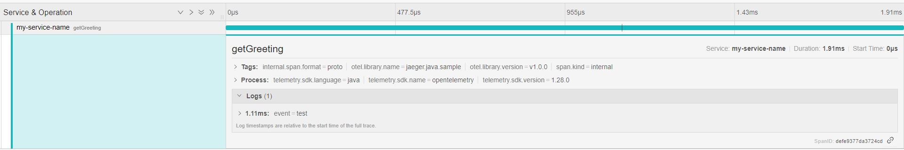

## jaeger java sample

- opentelemetry client + jaeger



## run

1. setup jaeger

- example) use All in One https://www.jaegertracing.io/docs/1.47/getting-started/
```
docker run -d --name jaeger \
  -e COLLECTOR_ZIPKIN_HOST_PORT=:9411 \
  -e COLLECTOR_OTLP_ENABLED=true \
  -p 6831:6831/udp \
  -p 6832:6832/udp \
  -p 5778:5778 \
  -p 16686:16686 \
  -p 4317:4317 \
  -p 4318:4318 \
  -p 14250:14250 \
  -p 14268:14268 \
  -p 14269:14269 \
  -p 9411:9411 \
  jaegertracing/all-in-one:1.47
```

2. run app

```
./gradlew run
```

3. view on ui

```
http://localhost:16686
```

## Reference
- https://opentelemetry.io/blog/2022/jaeger-native-otlp/
- https://github.com/open-telemetry/opentelemetry-java-examples/tree/main/jaeger/src/main/java/io/opentelemetry/example/jaeger